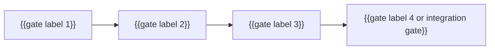
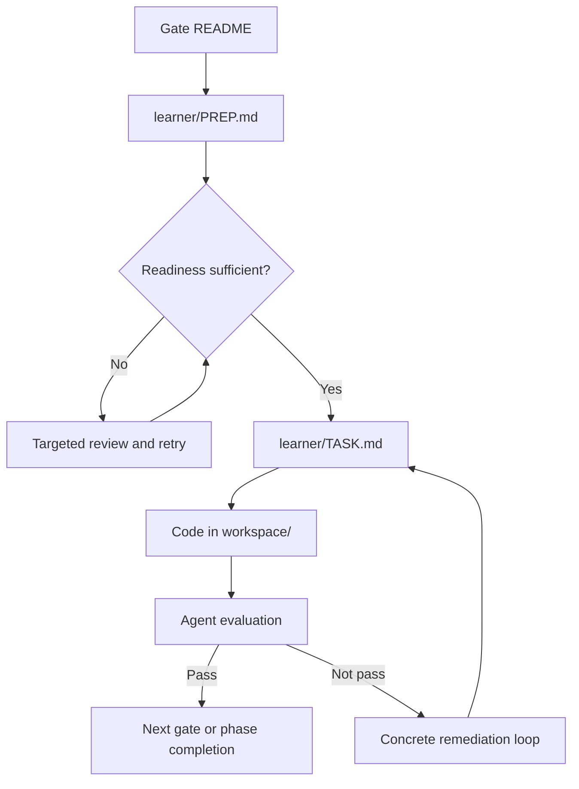

# Phase {{N}}: {{Display Name}}

## Purpose
{{Explain what this phase is for and why it exists in the progression.}}

This phase is about making these capabilities stable before the course moves deeper:
- {{capability 1}}
- {{capability 2}}
- {{capability 3}}

## What This Phase Builds
By the end of this phase, the learner should be able to:
- {{capability outcome 1}}
- {{capability outcome 2}}
- {{capability outcome 3}}

## Gate Lineup
This phase has {{micro-gate count}} micro-gates followed by {{integration gate note}}.

Extend or shorten the diagram and table below to match the actual gate count in the phase.

| Gate | Focus |
| --- | --- |
| [{{gate label 1}}](./{{gate-folder-1}}/README.md) | {{focus 1}} |
| [{{gate label 2}}](./{{gate-folder-2}}/README.md) | {{focus 2}} |
| [{{gate label 3}}](./{{gate-folder-3}}/README.md) | {{focus 3}} |
| [{{integration gate label}}](./{{integration-gate-folder}}/README.md) | {{integration gate focus}} |

## How To Use This Phase
Every gate in this phase follows the same runtime loop.

Working rule:
1. Open the current gate's `README.md`.
2. Move from `learner/PREP.md` into the readiness dialogue.
3. Start `learner/TASK.md` only after readiness is sufficient.
4. Work in `workspace/`.
5. Ask for evaluation when you have the required evidence.

## Where To Start
Start with [{{gate-folder}}/README.md](./{{gate-folder}}/README.md).

If you are returning mid-phase, open the current gate's `README.md` and continue from there.
