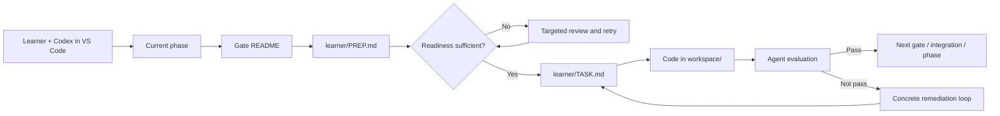

# C++ Systems Learning

Repository-backed C++ training system built for Codex-assisted learning in the editor.

## What This Is
This repository is a staged C++ learning program built for a learner-plus-agent workflow in the same codebase.

It combines:
- phase-based progression
- binary gates (`pass` / `not pass`)
- readiness before task work
- evaluation against code, build behavior, runtime behavior, and explanation
- curated resources instead of open-ended tutorial drift

## Intended Workflow
> *This system was designed around using OpenAI Codex as an integrated coding agent, primarily in VS Code.*
>
> *The repository structure, phase/gate model, and agent instructions are meant to support a workflow where the learner works locally in the editor while Codex provides controlled readiness checks, task support, and gate evaluation inside the same workspace.*
>
> *The setup was developed in VS Code and assumes an editor-centered workflow rather than a standalone chat-only experience.*

## Program Structure

- A `phase` builds one capability area.
- A `gate` is a bounded checkpoint inside that phase.
- An `integration gate` is the larger phase-ending task that combines earlier gate concepts without adding a major new topic.
- Every gate uses the same readiness, task, and evaluation loop shown above.
- Gates keep learner-facing material separate from agent-facing readiness and evaluation rules.

## Workspace And Solution Snapshots
- `workspace/` is the local working area for the current attempt.
- `workspace/main.cpp` is intentionally ignored by Git so the learner can iterate freely.
- `solution/` stores the tracked snapshot that most recently achieved a full `pass` for that gate.
- `solution/` is a portfolio/record artifact, not the normal learner starting point.

## Current Course
Only one phase is active today: [Phase 0: C++ Foundations](./01_phase0-cpp-foundations/README.md).

For the current active vs planned program surface, see [00_system/STATUS.md](./00_system/STATUS.md).

Phase 0 focuses on:
- compile/run discipline without IDE magic
- warnings as part of normal work
- simple console I/O
- first correct models for storage, references, and lifetime
- a bounded integration project that combines those basics

For the full Phase 0 gate arc, use [01_phase0-cpp-foundations/README.md](./01_phase0-cpp-foundations/README.md).

## Resource Base
The curated resource registry lives in [00_system/resources/RESOURCES.md](./00_system/resources/RESOURCES.md) and [00_system/resources/RESOURCE_MAP.md](./00_system/resources/RESOURCE_MAP.md).

| Resource | Role in the course | Why it is used |
| --- | --- | --- |
| [LearnCpp](https://www.learncpp.com/) | Primary Phase 0 spine | Incremental early coverage of compile/run, warnings, I/O, storage, references, classes, and early RAII |
| [GCC manual](https://gcc.gnu.org/onlinedocs/gcc/) | Compiler reference | Precise meaning of the baseline build command and flags |
| [cppreference](https://en.cppreference.com/w/) | Language reference | Exact lookup once the learner has a first mental model |
| [Stroustrup FAQ](https://www.stroustrup.com/bs_faq2.html) | Concept correction | Useful when the learner forms bad rules of thumb around values, references, and pointers |
| [MIT OpenCourseWare 6.096 notes](https://ocw.mit.edu/courses/6-096-introduction-to-c-january-iap-2011/pages/lecture-notes/) | Supplemental repetition | Alternate explanations when the main reading path is not enough |

Current practical baseline:
- Windows
- `g++` via `MSYS2 UCRT64`
- `-std=c++20`
- `-Wall -Wextra -Wpedantic`

## Start Here
- System or repo work: [AGENTS.md](./AGENTS.md) then [00_system/README.md](./00_system/README.md)
- Course content: [01_phase0-cpp-foundations/README.md](./01_phase0-cpp-foundations/README.md)
- First gate directly: [Gate 0: Compile, Run, and Basic I/O](./01_phase0-cpp-foundations/gate0-compile-run-basic-io/README.md)
- Tracked solution index: [PORTFOLIO.md](./PORTFOLIO.md)
